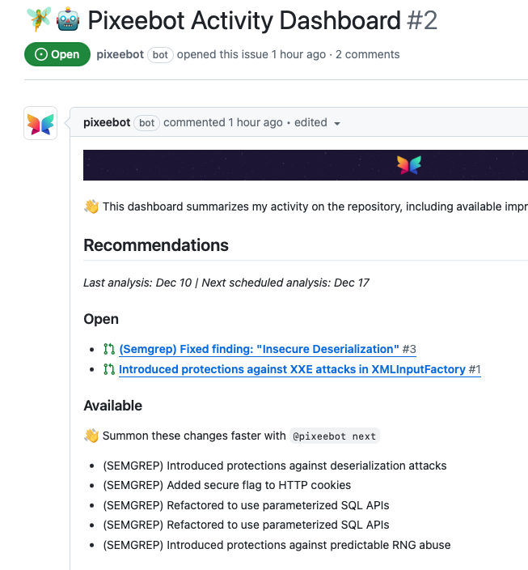

# Semgrep

Pixee can automatically triage and fix issues detected by [Semgrep](https://semgrep.dev/).

# GitHub Advanced Security

No setup is required for GitHub Advanced Security (GHAS) users to receive fixes from Semgrep results that are uploaded as Code Scanning alerts. Simply installing the Pixeebot GitHub App is sufficient.

# Others

Use the [pixee/upload-tool-results-action](https://github.com/pixee/upload-tool-results-action) GitHub Action together with the Pixeebot GitHub App to synchronize Semgrep findings with Pixee.

The following GitHub Action workflow example demonstrates how to include Semgrep vulnerability detection with Pixee fixes in a Java application:

```yaml
name: Analyze with Semgrep and Fix with Pixee

on:
  push:
    branches:
      - main
  pull_request:
    branches:
      - main

permissions:
  contents: read
  id-token: write

jobs:
  build:
    runs-on: ubuntu-latest

    steps:
      - name: Checkout repository
        uses: actions/checkout@v4

      - name: Set up JDK 17
        uses: actions/setup-java@v4
        with:
          java-version: "17"
          distribution: "temurin"

      - name: Build with Maven
        run: mvn --batch-mode verify

      - name: Install Semgrep
        run: |
          python3 -m pip install semgrep

      - name: Run Semgrep
        run: |
          semgrep --config auto --sarif --output semgrep-results.sarif.json

      - name: Fix with Pixee
        uses: pixee/upload-tool-results-action@v2
        with:
          tool: semgrep
          file: semgrep-results.sarif.json
```

This workflow:

1. Builds the Java project using Maven, to give Semgrep more context to find vulnerabilities.
2. Runs semgrep OSS on the project and stores the results in a standard SARIF file.
3. Runs the pixee/upload-tool-results-action that sends the SARIF file to Pixee.

Once Pixee receives the Semgrep vulnerabilities, it recalls them on its next analysis of this commit.

- When this commit the head of a pull request, then Pixee triggers its _PR Hardening_ analysis to fix as many Semgrep findings in this PR as it can.
- When this commit is the head of the main branch, then Pixee uses these findings the next time its _Continuous Improvement Campaign_ analysis runs. Users may trigger such an analysis to occur immediately by issuing the chat command `@pixeebot next` in any PR or issue comment on this repository. Pixee's continuous improvement campaign shows the queue of fixes in Pixeebot Acitvity Dashboard issue.

  
